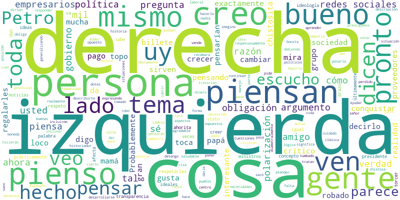

# SUBJETIVIDADES POLÍTICAS EN ADULTOS MEDIOS EN CALI- COLOMBIA

## Resumen
Objetivo. Analizar las subjetividades políticas en adultos intermedios entre 30 y 64 años de edad en la ciudad de Cali-Colombia en el periodo de enero y abril del año 2024. Método. La presente investigación se realiza a través de un estudio mixto con un diseño concurrente y convergente paralelo; con dos técnicas de recolección de datos, se aplicará un cuestionario en línea tipo likert a una muestra de 96 participantes, mientras que la entrevista semiestructurada se realizará  con 15 individuos; los factores de análisis serán polarización, emociones políticas e identidad. Resultados. Se encontró alta polarización política percibida, aunque con tendencia a respuestas "políticamente correctas". Predominaron emociones negativas como miedo y angustia. Hubo relación entre nivel educativo y angustia por pensamientos obsesivos. La identidad política se configuró por una interacción entre identidad social e individual moldeada por experiencias personales, familiares y el contexto histórico violento.  Discusión. El estudio muestra que las subjetividades políticas de los adultos en Cali están marcadas por una alta polarización, con una mayoría de participantes reconociendo la división, aunque muchos mantienen discursos neutrales públicamente debido a la presión social. A pesar de reconocer la importancia del diálogo, pocos muestran disposición a cambiar sus posturas o escuchar perspectivas diferentes. Las emociones predominantes, como miedo y angustia, llevan a las personas a refugiarse en grupos afines, evitando el contacto con opiniones contrarias. La identidad política se forma a partir de una compleja interacción entre influencias familiares, experiencias personales y el contexto histórico, reflejando una divergencia entre la identidad social expresada públicamente y la identidad individual. En general, la dificultad para el diálogo y la comprensión mutua, junto con la tendencia al aislamiento en grupos afines, resalta la complejidad del panorama político en Cali.

`Palabras claves:` subjetividades políticas, polarización, emociones políticas,  identidad social. 

## ABSTRACT
Objective. Analyze political subjectivities in intermediate adults between 30 and 64 years of age in the city of Cali-Colombia in the period of January and April 2024. Method. This research is carried out through a mixed study with a parallel concurrent and convergent design; with two data collection techniques, a Likert-type online questionnaire will be administered to a sample of 96 participants. Additionally, a semi-structured interview will be conducted with 30 individuals, all of whom are middle-aged adults aged between 30 and 64 years. The analyzed factors will include polarization, political emotions, and identity. Results.
High perceived political polarization was found, although there was a tendency towards "politically correct" responses. Negative emotions such as fear and anxiety predominated. There was a correlation between educational level and anxiety due to obsessive thoughts. Political identity was shaped by an interaction between social and individual identity, molded by personal, family experiences, and the violent historical context. Discussion. The study shows that the political subjectivities of adults in Cali are marked by high polarization, with a majority of participants acknowledging the division, although many maintain neutral public discourse due to social pressure. Despite recognizing the importance of dialogue, few show a willingness to change their stances or listen to different perspectives. Predominant emotions, such as fear and anxiety, lead individuals to seek refuge in like-minded groups, avoiding contact with opposing opinions. Political identity is formed through a complex interaction between family influences, personal experiences, and the historical context, reflecting a divergence between publicly expressed social identity and individual identity. Overall, the difficulty in dialogue and mutual understanding, along with the tendency to isolate within like-minded groups, highlights the complexity of the political landscape in Cali.

`Keywords:` political subjectivities, polarization, political emotions, social identity# Table of Contents

## Discusión
Este análisis explora las subjetividades políticas de adultos en Cali, revelando una alta polarización y predominio de emociones negativas. Aunque los participantes reconocen la división, pocos muestran disposición real para el diálogo o el cambio de postura. Evitan temas políticos para mantener relaciones afectivas, pero interactúan más con amigos que con familiares de ideología opuesta. Las emociones negativas como miedo y angustia llevan a refugiarse en "cámaras de eco", dificultando el diálogo. La relación entre nivel educativo y angustia sugiere influencia en la capacidad de manejar pensamientos obsesivos. La falta de congruencia interpersonal dificulta la colaboración y agrava el conflicto social. En resumen, la polarización y las emociones negativas limitan el diálogo y refuerzan la tendencia al aislamiento, destacando la complejidad del panorama político en Cali.

## Discussion
This analysis explores the political subjectivities of adults in Cali, revealing high polarization and a predominance of negative emotions. Although participants acknowledge the division, few show genuine willingness for dialogue or change of stance. They avoid political topics to maintain affective relationships, but interact more with friends than with family members of opposing ideologies. Negative emotions like fear and anguish lead to retreating into "echo chambers," hindering dialogue. The relationship between education level and distress suggests influence on coping with obsessive thoughts. Lack of interpersonal congruence complicates collaboration and exacerbates social conflict. In summary, polarization and negative emotions limit dialogue and reinforce the tendency toward isolation, highlighting the complexity of the political landscape in Cali.

##  Contact
For additional information or questions about the project, you can reach out to the following individuals:

- hannahmorab@javerianacali.edu.co
- stephaniap@javerianacali.edu.co
- vanessadelgado@javerianacali.edu.co

- [LinkedIn](www.linkedin.com/in/vanessa-delgado-01218421b)
- [LinkedIn](www.linkedin.com/in/hannah-mora-028181304)

We will be happy to assist you. Thank you for your interest in this project!